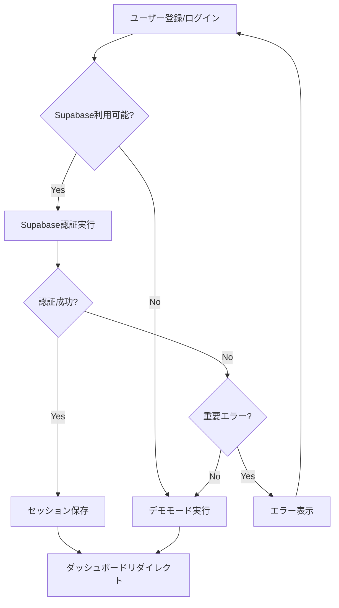

# 🚀 Supabase認証設定ガイド

## 📋 Supabase認証完全対応

PenaAppは現在、Supabase認証に完全対応しています！

### ✅ 実装済み機能

#### 🔐 認証機能
- [x] メール/パスワード認証
- [x] ユーザー登録（サインアップ）
- [x] ログイン/ログアウト
- [x] セッション管理
- [x] 自動トークンリフレッシュ
- [x] 認証状態の監視

#### 🛡️ セキュリティ機能
- [x] PKCE認証フロー
- [x] セッション永続化
- [x] 自動セッション検出
- [x] エラーハンドリング
- [x] デモモードフォールバック

#### 🎯 UX機能
- [x] 詳細なエラーメッセージ
- [x] 成功時のフィードバック
- [x] ローディング状態
- [x] 認証コールバック処理

## 🛠️ セットアップ手順

### 1. Supabaseプロジェクトの作成

1. **[Supabase](https://supabase.com)にアクセス**
2. **「New project」をクリック**
3. **プロジェクト情報を入力**
   - Name: `pena-app`
   - Database Password: 強いパスワードを設定
   - Region: Asia Northeast (東京)

### 2. 認証設定

#### 📧 Email認証の有効化
1. **Settings > Authentication**
2. **「Enable email confirmations」をON**
3. **「Enable signup」をON**

#### 🔗 Site URLの設定
```bash
# 開発環境
http://localhost:3000

# 本番環境  
https://your-app.vercel.app
```

#### 🔄 Redirect URLsの設定
```bash
# 開発環境
http://localhost:3000/auth/callback
http://localhost:3000/**

# 本番環境
https://your-app.vercel.app/auth/callback
https://your-app.vercel.app/**
```

### 3. 環境変数の設定

#### 📝 ローカル開発 (.env.local)
```bash
# Supabase設定
NEXT_PUBLIC_SUPABASE_URL=https://your-project-id.supabase.co
NEXT_PUBLIC_SUPABASE_ANON_KEY=eyJhbGciOiJIUzI1NiIsInR5cCI6IkpXVCJ9...

# アプリ設定
NEXT_PUBLIC_SITE_URL=http://localhost:3000
NODE_ENV=development
```

#### 🌐 本番環境 (Vercel)
```bash
# Vercelダッシュボード > Settings > Environment Variables
NEXT_PUBLIC_SUPABASE_URL=https://your-project-id.supabase.co
NEXT_PUBLIC_SUPABASE_ANON_KEY=eyJhbGciOiJIUzI1NiIsInR5cCI6IkpXVCJ9...
NEXT_PUBLIC_SITE_URL=https://your-app.vercel.app
NODE_ENV=production
```

### 4. API Keyの取得

1. **Supabase > Settings > API**
2. **「anon public」キーをコピー**
3. **「URL」をコピー**

## 🔧 技術仕様

### 認証フロー


### 認証状態管理
- **useAuth hook**: リアルタイム認証状態監視
- **自動セッション復元**: ページリロード時の状態保持
- **ハイブリッド管理**: Supabase + ローカルストレージ

### エラーハンドリング
```typescript
// 具体的なエラーメッセージ
'Invalid login credentials' → 'メールアドレスまたはパスワードが正しくありません'
'Email not confirmed' → 'メールアドレスの確認が完了していません'
'User already registered' → 'このメールアドレスは既に登録されています'
```

## 🧪 テスト方法

### 1. ローカルテスト
```bash
# 1. 開発サーバー起動
npm run dev

# 2. ブラウザで確認
http://localhost:3000/auth

# 3. コンソールでSupabase状態確認
console.log('SUPABASE_URL:', process.env.NEXT_PUBLIC_SUPABASE_URL)
```

### 2. 認証テストケース
- [ ] **新規ユーザー登録**
- [ ] **確認メール送信**
- [ ] **メール認証後ログイン**
- [ ] **パスワード間違い**
- [ ] **存在しないユーザー**
- [ ] **セッション永続化**

### 3. フォールバック機能テスト
- [ ] **環境変数未設定時**
- [ ] **Supabaseサーバーエラー時**
- [ ] **ネットワークエラー時**

## 🚨 トラブルシューティング

### よくある問題

#### 1. 「Supabase環境変数が設定されていません」
**解決策:**
- `.env.local`ファイルの確認
- 環境変数名のタイプミス確認
- サーバー再起動

#### 2. 「メールアドレスの確認が完了していません」
**解決策:**
- メールボックスをチェック
- スパムフォルダを確認
- Supabaseで確認メール再送信

#### 3. 「認証コードの処理に失敗しました」
**解決策:**
- Redirect URLsの設定確認
- Site URLの設定確認
- ブラウザキャッシュクリア

### デバッグコマンド
```typescript
// ブラウザコンソールで実行
localStorage.getItem('penaapp_user')
localStorage.getItem('penaapp_session')

// Supabaseクライアント確認
import { createClient } from '@/lib/supabase/client'
const supabase = createClient()
console.log('Supabase client:', supabase)
```

## 🎉 完了！

設定が完了すると以下が利用できます：

✅ **完全なSupabase認証**
✅ **自動フォールバック機能**  
✅ **リアルタイム認証状態**
✅ **セキュアなセッション管理**

**Happy Authenticating! 🔐✨**
